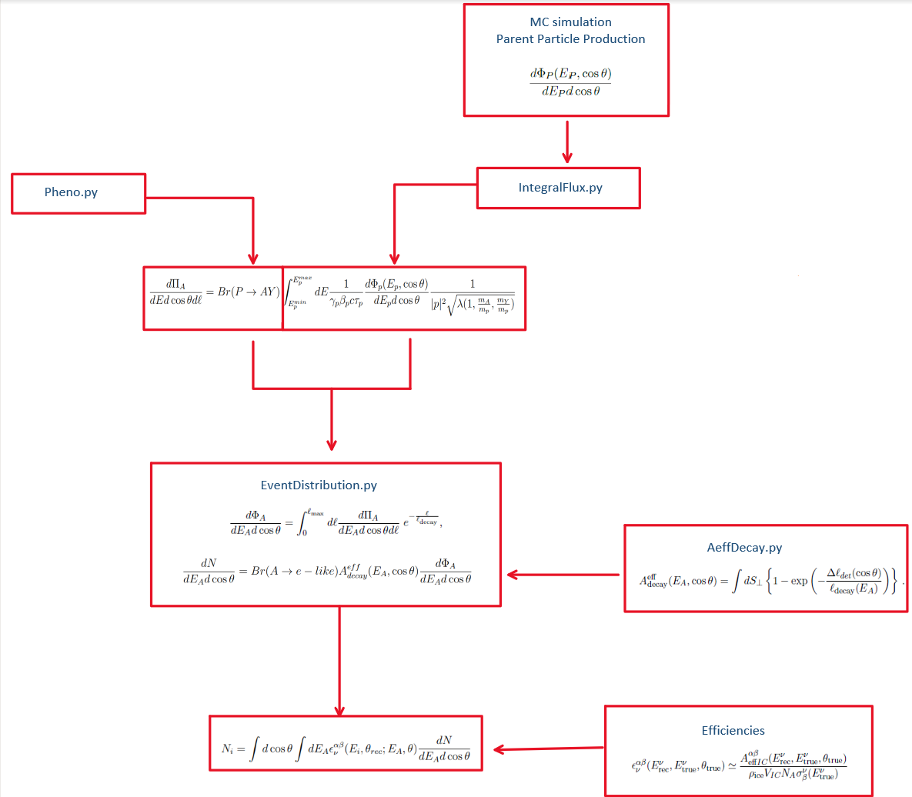

[](https://arxiv.org/abs/1234.56789)

# Searching for light long-lived neutralinos at Super-Kamiokande

This repository contains the scripts and notebooks to reproduce the results in [arXiv:123]()

## Abstract 

Light neutralinos can be copiously produced from the decays of mesons generated in cosmic-ray 
air-showers. These neutralinos can be long-lived particles in the context of R-parity 
violating (RPV) supersymmetric models, implying that they could be capable of reaching the
surface of the earth and decay within the instrumental volume of large neutrino detectors.
In this letter, we use atmospheric neutrino data from the Super-Kamiokande experiment to
derive stringent constraints for the RPV couplings involved in the production of 
long-lived light neutralinos from the decays of charged D-mesons and kaons.
Our results highlight the potential of neutrino detectors to search for long-lived
particles by showing that it is possible to explore regions of parameter space that are not 
yet constrained by any beam-based experiment.


<div align="center">
 

</div>


## Folder Structure 

```
LongLivedNeutralinos
│  
└───main
    │  
    ├───datafiles			        # folder with output files from scripts
    │   ├───Aeff		          	# Output files from Aeff.py
    │   ├───chi2                    		# Pending
    │   ├───Efficiency		    		# Pending
    │   ├───EventDistribution			# Output files from EventDistribution.py
    │   ├───MesonFlux		      		# MC Atmospheric Meson Flux
    │   ├───NeutralinoFlux	    		# Output files from FluxIntegral.py
    │   ├───NeutralinoPheno	  		# Output files from Pheno.py
    │   └───SK_data 		      		# CSV files with SK data
    │   
    ├───notebooks		          	# Notebooks with the results
    │  
    └───plots			            	# Figures and other plots
```


## Getting the code

You can download a copy of all the files in this repository by cloning the
[git](https://git-scm.com/) repository:

    $ git clone https://github.com/aimendez/longlivedneutralino.git

or [download a zip archive](https://github.com/aimendez/longlivedneutralino/archive/refs/heads/master.zip).

## Dependencies 

```Python >= 3.6.0``` required. All dependencies can be installed with ```pip``` and the ```requirements.txt``` file 
from the terminal using the following command:

```bash
$ pip install -r requirements.txt 
```

## Usage

It is possible to run and get all the necessary files for an specific benchmark by running a single batch file ```run.bat```.
Benchmarks are defined in ```config.py```, and they have to be specified as a dictionary (see below).


### config.py 

This file contains all the benchmarks stored as (key, value) pairs of a global dictionary ```BM```. To run a custom benchmark, it has to be specified as a new item in```BM```,
where the key is the name of the custom benchmark  ```"BM_NAME"``` , and the value is a dictionary with the following format:
```python
BM  = {
	"BM_NAME" : {	
                # BRIEF DESCRIPTION OF BENCHMARK #
                "MESON": MESON,
                "MA": MA,
                "LAM_PROD": LAM_PROD,
                "LAM_PROD_RANGE": LAM_PROD_RANGE,
                "LAM_DEC": LAM_DEC,
                "LAM_DEC_RANGE":LAM_DEC_RANGE,
                "MSFERM": MSFERM,
                "LEPTON": LEPTON,
                "EQUAL_COUPLING": EQUAL_COUPLING,
                "MODEL": MODEL,
	}
}
```
#### Parameters:

* **MESON**: string {"D+", "K+"}
  
  Name of the parent messon in the atmospheric shower. It can be any meson in {"D+", "K+"}.

* **MA** : list or array-like

  Range for the value of the neutralino mass.

* **LAM_PROD** : String {"lamijk"}

  String to specify the RpV lambda coupling associated with the production of neutralinos. It has to follow the format "lamijk" where i,j,k = {1,2,3}.

* **LAM_PROD_RANGE**:  list or array-like

  Range for LAM_PROD.

* **LAM_DEC**:  string  {"lamijk"}

  String to specify the RpV lambda coupling associated with the decay of the neutralinos. It has to follow the format "lamijk" where i,j,k = {1,2,3}.

* **LAM_DEC_RANGE**:  list or array-like

  Range for LAM_DEC.

* **MSFERM**: float 

  Mass of the sfermion that mediates the decay.

* **LEPTON**: string {"e", "mu", "tau"}

  Lepton in the final state. It can be any lepton {"e", "mu", "tau"}.

* **EQUAL_COUPLING**: bool

  Flag to explore the parameter space where the RpV Lambda couplings LAM_PROD and LAM_DEC equal.

* **MODEL**: string {"SYBILL", "EPOS-LHC", "DPMJET", "QGSJET"}

  Name of the hadronic model used to simulate the meson flux. Models availabels are {"SYBILL", "EPOS-LHC", "DPMJET", "QGSJET"}.


### Run benchmark 

Once a benchmark is defined, it can be run from the terminal using the following command from the main directory:

```bash
$ cd <repository_name>/main/
$ run.bat BM_NAME
```

Where ```BM_NAME``` is the same name of the benchmark specified previously in ```config.py``` without quotation marks.

### Inspect the Results 

Results are stored in the notebook ```results.ipynb```. To inspect it, open Jupyter Notebooks from the terminal:

```
$ cd <repository_name>/main/notebooks/
$ jupyter notebook
```
## Workflow 

Scripts in  ```run.bat``` compute the final number of event following the workflow displayed below.
<div align="center">

</div>

## To Do

- <s> Include Physical Constants for Kaons in FluxIntegral.py </s>
- <s> Check integral function for Kaons in FluxIntegral.py </s>
- <s> Add Hadronic Model option in config.py and modify paths </s>
- Create CHI2 python script and create chi2 output
- Add multiprocessing option for EventDistribution.py
- <s> Create bash script to run a single BM at once </s>
- Add default BM and exceptions
- Bash file support for Linux
- <s> Change to a free parameter lam_ijk/m^2 in Pheno.py </s>

## Authors

- Pablo Candia [@pcandias]() - [pablo.candiadasilva@manchester.ac.uk]()
- Giovanna Cottin [@????]() - [giovanna.cottin@uai.cl]()
- Andres Mendez [@aimendez](https://www.github.com/aimendez) - [aimendez@uc.cl]()
- Victor Munos [@vmmunoza](https://github.com/vmmunoza/) - [victor.manuel.munoz@ific.uv.es]()
  
## Support - Feedback 

For support or feedback, email aimendez@uc.cl or any other member of the author list.


  